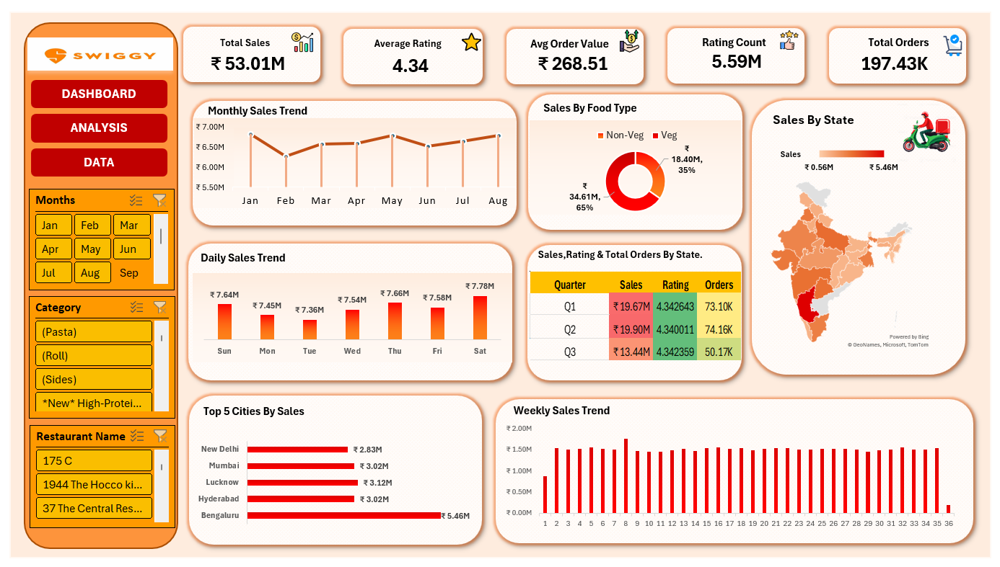

# 🍽️ Swiggy Sales Analysis Dashboard

<p align="center">


</p>

---

## 📌 Project Overview

The **Swiggy Sales Analysis Dashboard** is an interactive business intelligence dashboard built entirely in **Microsoft Excel**. The project analyzes food delivery sales data to uncover valuable business insights through dynamic visualizations, KPIs, Pivot Tables, charts, and slicers.

This dashboard enables users to monitor sales performance, analyze customer ordering patterns, compare regional performance, and make data-driven business decisions.

---

# 📸 Dashboard Preview

<p align="center">

</p>

---

# 🎯 Business Objective

The primary objective of this project is to analyze Swiggy's sales performance and provide actionable insights by answering key business questions such as:

- Which states generate the highest sales?
- Which cities contribute the most revenue?
- How do sales vary over time?
- What is the Average Order Value?
- What are the customer rating trends?
- What percentage of sales comes from Veg vs Non-Veg food?

---

# 📊 Dashboard KPIs

| KPI | Value |
|------|-------|
| 💰 Total Sales | ₹53.01M |
| ⭐ Average Rating | 4.34 |
| 🛒 Average Order Value | ₹268.51 |
| 👍 Rating Count | 5.59M |
| 📦 Total Orders | 197.43K |

---

# 📈 Dashboard Features

✅ Interactive Dashboard

✅ Dynamic Slicers

✅ Monthly Sales Trend

✅ Daily Sales Trend

✅ Weekly Sales Trend

✅ Sales by Food Type

✅ State-wise Sales Analysis

✅ Top 5 Cities by Sales

✅ Quarterly Sales Performance

✅ Restaurant-wise Filtering

✅ Category-wise Filtering

---

# 📉 Key Insights

- Karnataka generated the highest overall sales.
- Bengaluru emerged as the top-performing city.
- Non-Veg food contributed a larger share of total sales than Veg food.
- Weekend sales were generally higher than weekday sales.
- Customer ratings remained consistently above **4.3**, indicating strong customer satisfaction.
- Average Order Value remained around **₹268** across all orders.

---

# 🛠️ Tools & Technologies

- Microsoft Excel
- Pivot Tables
- Pivot Charts
- Slicers
- Conditional Formatting
- Data Cleaning
- Dashboard Design
- Data Visualization
- Business Analysis

---

# 📂 Project Structure

```
Swiggy-Analysis-Project
│
├── 📄 Swiggy-Analysis-Project.xlsx
├── 📄 Raw-Data.xlsx
├── 🖼️ Project-Image.png
└── 📘 README.md
```

---

# 🚀 Skills Demonstrated

- Data Cleaning
- Data Analysis
- Dashboard Development
- KPI Reporting
- Business Intelligence
- Interactive Reporting
- Excel Automation
- Data Visualization
- Problem Solving

---

# 📌 Business Questions Answered

✔ Which state has the highest sales?

✔ Which city generates maximum revenue?

✔ What is the monthly sales trend?

✔ What is the daily sales trend?

✔ What is the weekly sales trend?

✔ Which food type sells the most?

✔ What is the average customer rating?

✔ What is the average order value?

✔ Which restaurants contribute the most orders?

---

# 🌟 Project Highlights

- Professional Dashboard Design
- Interactive User Experience
- Real-world Business Scenario
- Clean & Organized Layout
- Easy-to-understand Visualizations
- Recruiter-Friendly Portfolio Project

---

# 📚 Learning Outcomes

Through this project, I gained hands-on experience in:

- Designing professional Excel dashboards
- Creating interactive reports using slicers
- Building KPI cards
- Performing business data analysis
- Creating Pivot Tables & Pivot Charts
- Presenting insights through visualization

---

# 🤝 Connect With Me

**LinkedIn:** www.linkedin.com/in/sanikaauti736

**GitHub:** https://github.com/sanikaautidata

---

## ⭐ If you found this project helpful, don't forget to Star this repository!
